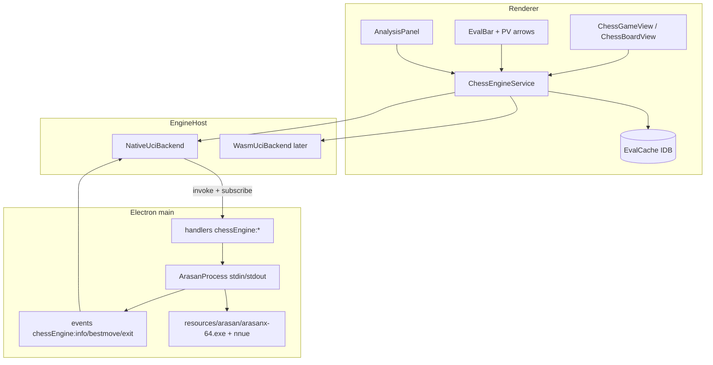
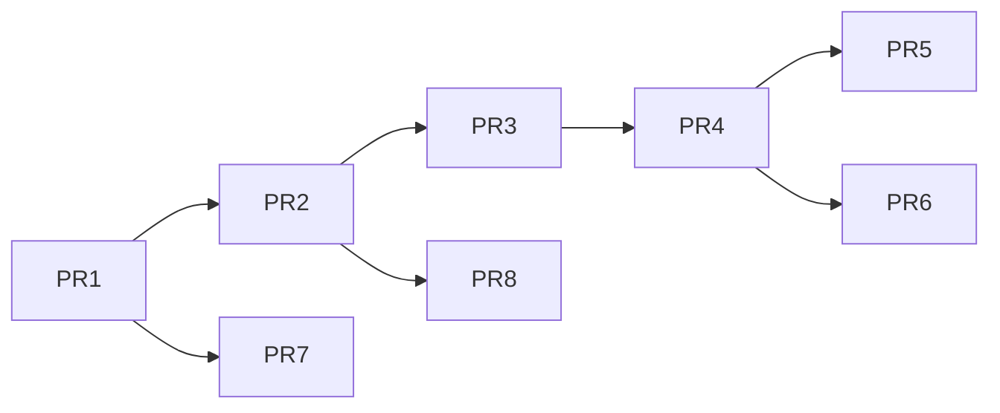

# Design: P2 — Phân tích cờ vua offline (Arasan)

|               |                                                                                                          |
| ------------- | -------------------------------------------------------------------------------------------------------- |
| **Status**    | Delivered 2026-08-19 — PR1–PR6. Bàn giao P3: [p2-ket-qua-ban-giao.md](p2-ket-qua-ban-giao.md)            |
| **Date**      | 2026-08-19                                                                                               |
| **Author**    | Grok (design skill, plan mode)                                                                           |
| **Scope**     | Phase 2 của [docs/ke-hoach-tong-the.md](docs/ke-hoach-tong-the.md)                                       |
| **Không làm** | P0 rebrand, nốt P1 (kéo `.pgn`, bộ quân đặt vẽ, i18n đầy đủ), P3 AI/MCP, P4 backend, C5/C6 server engine |

---

## Overview

P1 đã có bàn cờ, PGN (nguồn sự thật), biến lồng, NAG thủ công và replay. P2 thêm **phân tích offline**: engine Arasan (MIT) chạy trên máy người dùng, thanh eval, mũi tên nước tốt nhất, quét ván (Inaccuracy / Mistake / Blunder + ACPL), cache eval theo FEN.

Sản phẩm bán được sau P2: **app desktop local-first có phân tích**, không cần mạng, không cần backend.

Cách làm: **native-first trên Electron (Windows trước)**. WASM là track song song, không nằm trên đường găng. Không có server engine trong P2.

---

## Background & Motivation

### Hiện trạng (đã đọc code)

| Lớp          | Thực tế                                                                                                                                                              |
| ------------ | -------------------------------------------------------------------------------------------------------------------------------------------------------------------- |
| Luật / PGN   | `@blocksuite/chess-core` — 0x88 tự viết, `parsePgn`/`serializePgn`, `walk`/`mainLine`, `moveToUci`, 109 unit test. **Không** dùng `chess.js`.                        |
| Block ván    | `affine:chess-game` — props `{ pgn, currentPath, orientation, caption }`. PGN là nguồn sự thật. Schema **version 1**, prop mới được backfill, **cấm bump version**.  |
| Block bàn    | `affine:chess-board` — FEN + arrows/highlights. Toolbar đã có copy FEN / lật / khóa.                                                                                 |
| UI           | React qua `reactToLit` trong `packages/frontend/core/src/blocksuite/view-extensions/chess/`. `Chessboard` đã nhận `arrows` / `highlights`. NAG `! ? !! ??` đã có UI. |
| Feature flag | Chess **không** có flag — luôn bật. `AFFINE_FLAGS` chưa có `enable_chess_*`.                                                                                         |
| Electron IPC | Namespace trong `allHandlers` + `allEvents` → preload tự expose. Streaming theo mẫu `updaterEvents` (RxJS `Subject`).                                                |
| Worker web   | `getBaseWorkerConfigs` đăng ký pdf/typst/mermaid/turbo. Rspack đã `asyncWebAssembly: true`. `*.wasm?url` đã declare.                                                 |
| COOP/COEP    | **Không có**. `crossOriginIsolated` sẽ là `false` → **SharedArrayBuffer / pthread WASM không chạy**.                                                                 |
| i18n         | `vi` đã nằm trong `SUPPORTED_LANGUAGES`; namespace `chess.*` gần như chưa có chuỗi.                                                                                  |

### Vì sao P2 phải thiết kế khác bản “WASM trước” trong kế hoạch gốc

Kế hoạch tổng thể xếp C1 (WASM) trước C3 (native) nếu phát hành web trước. Ba sự thật trên cây hiện tại đảo thứ tự:

1. Không có bản WASM chính thức của Arasan — đây là việc R&D, không phải việc đóng gói.
2. App **chưa** bật Cross-Origin Isolation. Pthread + SIMD (cách duy nhất để WASM mạnh) đòi `SharedArrayBuffer`. Bật COOP/COEP trên toàn app AFFiNE đụng OAuth popup và hàng loạt embed iframe — rủi ro sản phẩm, không phải rủi ro engine.
3. Người dùng đang làm việc trên **Windows**; sản phẩm bán được của P2 là **desktop**. Native UCI qua `child_process` là việc nhỏ (S), đã có mẫu `utilityProcess.fork` / `spawnSync`.

C5/C6 (engine phía server + hạ cấp WASM → server) **cần backend → P4**. Đưa vào P2 sẽ phá nguyên tắc “P2 không backend”.

---

## Goals & Non-Goals

### Goals

1. Phân tích vị trí hiện tại: eval streaming, PV, mũi tên nước 1, thanh eval.
2. Quét ván (mặc định **main line**): gắn nhãn Inaccuracy / Mistake / Blunder, ACPL từng bên, tiến độ huỷ được.
3. Cache eval theo FEN trong IndexedDB — khai cuộc trùng nhiều.
4. Một hợp đồng `EngineHost` dùng chung native và WASM (và sau này P3 MCP / P4 server).
5. Desktop Windows chạy Arasan native, không cần mạng.
6. Web **không gãy**: UI phân tích ẩn hoặc báo “có trên desktop” cho đến khi WASM (hoặc P4) sẵn sàng.
7. Không ghi đè PGN trừ khi người dùng bấm “Gắn vào PGN”.

### Non-Goals (P2)

- Backend, copilot, MCP Hub, tool `chess.analyze` (P3 chỉ _gọi_ `EngineHost`).
- Tablebase Syzygy, opening book.bin, strength limit, ponder.
- Quét mọi biến lồng (chỉ main line; biến để P2.x).
- Bật COOP/COEP toàn app.
- Mobile.
- Dịch tiếng Việt đầy đủ / bộ quân đặt vẽ / kéo-thả `.pgn` (nốt P1, không chặn P2).
- Rebrand / cắt EE (P0).

---

## Proposed Design

### 1. Kiến trúc



Một process engine / một instance WASM cho cả app. Nhiều block `affine:chess-game` trên một trang **không** được spawn N engine.

### 2. Bố cục package

| Package / thư mục                                              | Việc                                                                                                                                              |
| -------------------------------------------------------------- | ------------------------------------------------------------------------------------------------------------------------------------------------- |
| `blocksuite/chess/engine/` → `@blocksuite/chess-engine`        | Thuần TS, 0 I/O: kiểu, parse UCI `info`, phân loại, thuật toán scan, cache interface + memory impl. Workspace tự nhận nhờ glob `blocksuite/**/*`. |
| `packages/frontend/core/src/modules/chess-engine/`             | `ChessEngineService` (infra `Service`), IDB cache, chọn backend, hook UI.                                                                         |
| `packages/frontend/core/src/blocksuite/view-extensions/chess/` | Eval bar, tô màu movelist, nút Analyze/Scan/Stop, mũi tên engine.                                                                                 |
| `packages/frontend/apps/electron/src/main/chess-engine/`       | Spawn, UCI session, handlers, events.                                                                                                             |
| `packages/frontend/apps/electron/resources/arasan/`            | Binary + file NNUE + `LICENSE` (qua `extraResource`, **ngoài** asar).                                                                             |
| `third_party/arasan/` (manifest, không nhét source)            | `version.json` (tag, sha256, URL), script `scripts/fetch-arasan.mjs`.                                                                             |

Không compile Arasan trong `yarn affine build`. CI app chỉ kiểm tra manifest + checksum khi file có mặt.

### 3. Hợp đồng `EngineHost`

Toàn bộ backend (native, WASM, sau này server) tuân cùng API. P3 MCP và P4 server chỉ thêm adapter.

```ts
// blocksuite/chess/engine/src/types.ts

export type Score = { type: 'cp' | 'mate'; value: number };

export interface AnalyzeRequest {
  jobId: string; // uuid; event stale bị bỏ
  fen: string; // FEN đủ 6 trường, đã validate bằng parseFen
  depth?: number; // thiếu = go infinite (live)
  movetimeMs?: number;
  multipv?: number; // mặc định 1
}

export interface EngineInfo {
  jobId: string;
  depth: number;
  seldepth?: number;
  multipv: number;
  score: Score;
  pv: string[]; // UCI, vd e2e4
  nodes?: number;
  nps?: number;
  timeMs?: number;
}

export interface EngineBestMove {
  jobId: string;
  bestmove: string;
  ponder?: string;
}

export interface EngineHost {
  readonly id: string; // 'arasan-native' | 'arasan-wasm'
  readonly engineVersion: string;
  readonly ready: Promise<void>;
  analyze(req: AnalyzeRequest): Promise<void>;
  stop(jobId?: string): Promise<void>;
  subscribe(
    listener: (
      ev: EngineInfo | EngineBestMove | { type: 'exit'; code: number }
    ) => void
  ): () => void;
  dispose(): Promise<void>;
}
```

`analyze` **không** trả eval cuối — eval đi qua `subscribe` (streaming). Caller gộp info theo `(jobId, multipv)` và chốt khi nhận `bestmove`.

Hàng đợi trong `ChessEngineService`:

- Một lúc một job trên engine.
- Live analyze vị trí mới → `stop()` job live cũ, rồi `analyze` mới (debounce 150ms).
- Scan là chuỗi `analyze(depth=D, multipv=2)` tuần tự; `stop` huỷ cả chuỗi.
- Live và scan **không** chạy song song trên cùng host (scan bị pause nếu user bật live trên ván đang quét, hoặc ngược lại — chọn: scan ưu tiên, live đợi).

### 4. Native UCI (đường chính P2)

#### 4.1 Binary

- Pin một release Arasan ổn định (hiện line 25.x, MIT, NNUE ngoài binary — xác nhận tag + sha256 **sau khi duyệt**, bước preflight).
- Windows x64: ship `arasanx-64-avx2` và fallback `arasanx-64` (SSE2). Detect CPU một lần lúc spawn; nếu AVX2 không có thì chạy fallback.
- macOS (arm64/x64) và Linux x64: PR riêng sau Windows, cùng layout thư mục.
- **Không** ship `gui/` (GUI Windows của Arasan dùng piece set Lichess — GPL/CC, ngoài phạm vi).
- **Không** ship `book.bin` trong P2 (phân tích phải là eval thật).
- File NNUE đặt **cùng thư mục** binary (`NNUE File` UCI giả định vậy).
- `LICENSE` Arasan copy vào `resources/arasan/LICENSE` và liệt kê trong `THIRD-PARTY-NOTICES`.

Đóng gói Electron — thêm vào `forge.config.mjs` `packagerConfig.extraResource`:

```js
extraResource: [
  './resources/app-update.yml',
  './resources/arasan',
  // ...
];
```

Đường dẫn runtime: `join(process.resourcesPath, 'arasan', exeName)`. Dev: `join(electronRoot, 'resources/arasan', exeName)`.

`extraResource` nằm ngoài asar → không cần `asarUnpack`.

#### 4.2 Process

`packages/frontend/apps/electron/src/main/chess-engine/process.ts`:

- `spawn(exe, [], { stdio: ['pipe','pipe','pipe'], windowsHide: true, shell: false })`.
- **Cấm** `shell: true`. Không nội suy FEN/PGN vào command line.
- Handshake: `uci` → đợi `uciok`; `setoption` (dưới); `isready` → `readyok`.
- Line-buffer stdout; mỗi dòng UCI parse ở main (lưu lượng thấp, không cần utilityProcess).
- Crash → log, emit `exit`, restart lazy lần analyze sau (tối đa 3 lần / phiên).
- `beforeAppQuit`: gửi `quit`, timeout 500ms, rồi `kill`.
- Lazy spawn: không mở engine khi app start.

UCI options lúc khởi tạo:

| Option            | Giá trị                             | Lý do                                                                      |
| ----------------- | ----------------------------------- | -------------------------------------------------------------------------- |
| Hash              | 64 (MB — đơn vị thật của Arasan 26) | Đủ cho depth 14–20, không nuốt RAM máy học. README upstream ghi KB là sai. |
| Threads           | `min(4, max(1, cpus-1))`            | Scan nhanh hơn 1 thread, không đóng băng UI                                |
| OwnBook           | false                               | Phân tích ≠ chơi theo sách                                                 |
| Ponder            | false                               |                                                                            |
| MultiPV           | set theo từng job                   |                                                                            |
| Use tablebases    | false                               | P2 không ship TB                                                           |
| Position learning | false                               | Không ghi file cạnh binary                                                 |

Gửi vị trí: `ucinewgame` một lần / scan; mỗi job: `position fen <fen>` rồi `go depth N multipv K` hoặc `go infinite`. Huỷ: `stop`.

Validate FEN bằng `@blocksuite/chess-core` `parseFen` **trước** khi gửi. Từ chối FEN không parse được.

#### 4.3 IPC

Thêm namespace — `allHandlers` / `allEvents` tự expose qua `getExposedMeta` (không sửa preload).

```ts
// handlers
chessEngine: {
  status: () =>
    Promise<{ available: boolean; backend: 'native'; version: string }>;
  analyze: (_e, req: AnalyzeRequest) => Promise<void>;
  stop: (_e, jobId?: string) => Promise<void>;
}

// events (mẫu updaterEvents)
chessEngine: {
  onInfo: (fn: (info: EngineInfo) => void) => unsubscribe;
  onBestMove: (fn: (bm: EngineBestMove) => void) => unsubscribe;
  onExit: (fn: (ev: { code: number }) => void) => unsubscribe;
}
```

Renderer: `DesktopApiService.handler.chessEngine.*` và `events.chessEngine.onInfo`.

### 5. WASM (track 2, không chặn desktop)

Mục tiêu: web cũng phân tích được, **single-thread + SIMD**, không pthread.

| Quyết định                   | Lý do                                                                                                                |
| ---------------------------- | -------------------------------------------------------------------------------------------------------------------- |
| Không bật COOP/COEP trong P2 | Đụng OAuth + embed; không có bằng chứng app đã isolate                                                               |
| Single-thread                | Chạy được trên worker thường, đăng ký trong `getBaseWorkerConfigs` như pdf/typst                                     |
| Cùng UCI                     | Compile Arasan như executable Emscripten, JS bọc stdin/stdout — `WasmUciBackend` implement `EngineHost`              |
| NNUE                         | Fetch 1 lần, Cache Storage / IDB, mount vào FS ảo của Emscripten                                                     |
| Scan trên web                | Có thể chậm 3–8× native. Live depth 12 vẫn dùng được. Nếu spike < depth 10 trong 2s → chỉ bật live, ẩn Scan trên web |

Nếu spike Emscripten thất bại (pthread bắt buộc, SIMD intrinsic, file NNUE quá lớn): **web không có engine trong P2**. Desktop vẫn bán được. Đây là phương án dự phòng đã ghi trong kế hoạch tổng thể.

PR WASM tách khỏi PR native. Không block merge desktop.

### 6. Cache eval

Khoá:

```
`${engineVersion}|d${depth}|mpv${multipv}|${fen4}`
```

`fen4` = 4 trường FEN đầu (placement, turn, castling, ep). Bỏ halfmove/fullmove — không đổi eval.

Giá trị: snapshot chốt (`score`, `pv[]` theo multipv, `nodes`, `depth`). Không lưu từng dòng `info` trung gian.

Lớp:

- Interface trong `@blocksuite/chess-engine` (`get`/`set`/`clear`).
- Memory LRU (256 mục) — test và hot path.
- IndexedDB `chess-engine-eval` (store `evals`) trong `packages/frontend/core` — dùng trên web **và** Electron renderer (workspace local vốn đã IDB). Không đụng `@affine/native` SQLite (P0 chưa cắt EE, đừng thêm phụ thuộc native).

Giới hạn: 32 MB ước lượng / eviction LRU. Không TTL — vị trí + version engine là khoá đủ.

Cache hit: không gọi engine; vẫn emit một `EngineInfo` giả + `bestmove` để UI đồng nhất.

### 7. Thuật toán quét ván

Chỉ **main line** (`mainLine(game)`). Mỗi vị trí một lần phân tích — rẻ hơn “analyze before + after nếu lệch PV”.

```
positions = [toFen(game.setup), ...mainLine(game).map(n => n.fenAfter)]
for fen of positions:
    report[fen] = analyze(fen, depth=scanDepth, multipv=2)  // cache-aware

for i, node of mainLine:
    before = report[node.fenBefore]
    after  = report[node.fenAfter]
    playedUci = moveToUci(node.move)
    bestUci = before.pv[0]
    moverCpl = cplForMover(before, after, turn(node.fenBefore))
    label = classify(moverCpl, before.score, after.score)
```

#### 7.1 Quy về centipawn phía trắng rồi phía người đi

UCI `score` luôn theo **bên được đi**.

```ts
function whiteCp(score: Score, turn: Color): number {
  const cp =
    score.type === 'mate' ? Math.sign(score.value) * 10_000 : score.value;
  return turn === WHITE ? cp : -cp;
}

function moverCpl(before: EngineInfo, after: EngineInfo, turn: Color): number {
  const lossWhite =
    whiteCp(before.score, turn) - whiteCp(after.score, opposite(turn));
  return turn === WHITE ? lossWhite : -lossWhite;
}
```

`moverCpl < 0` (engine đổi ý có lợi hơn nước đi) kẹp về 0 — không thưởng “may hơn engine”.

#### 7.2 Phân loại theo win% (kiểu Lichess), không theo ngưỡng cp thô

Ngưỡng cp thô coi +800 → +700 là “lỗi” — sai cho thế hơn rõ. Dùng công thức public của Lichess:

```ts
function winningChances(cp: number): number {
  const clamped = Math.max(-10_000, Math.min(10_000, cp));
  return 2 / (1 + Math.exp(-0.00368208 * clamped)) - 1;
}

/** evalBest / evalPlayed: centipawn từ phía người vừa đi (dương = tốt cho họ). */
function classify(
  evalBest: number,
  evalPlayed: number
): 'best' | 'inaccuracy' | 'mistake' | 'blunder' {
  const loss = winningChances(evalBest) - winningChances(evalPlayed);
  if (loss >= 0.3) return 'blunder';
  if (loss >= 0.2) return 'mistake';
  if (loss >= 0.1) return 'inaccuracy';
  return 'best';
}
```

Mate: quy `±10000` trước khi gọi `winningChances` (đã làm ở `whiteCp`). `evalBest` lấy từ `score` của vị trí trước nước đi; `evalPlayed` lấy từ `-score` của vị trí sau (đổi phía).

NAG khi user **chủ động** gắn vào PGN:

| Label      | NAG                                                                                       |
| ---------- | ----------------------------------------------------------------------------------------- |
| best       | không gắn (hoặc `$1` chỉ khi loss ≈ 0 **và** user bật “đánh dấu nước tốt” — mặc định tắt) |
| inaccuracy | `$6` (`?!`)                                                                               |
| mistake    | `$2` (`?`)                                                                                |
| blunder    | `$4` (`??`)                                                                               |

Không tự gắn `!!` — đó là phán đoán thẩm mỹ, để P3/người.

#### 7.3 ACPL

Trung bình `min(moverCpl, 1000)` trên các nước của từng bên. Bỏ nước đầu nếu muốn (không — đơn giản hơn, user hiểu hơn).

#### 7.4 Thời gian kỳ vọng

|                         | Native depth 14, 2 thread | WASM ST depth 12 |
| ----------------------- | ------------------------- | ---------------- |
| 1 vị trí (cache miss)   | ~0.3–1.0 s                | ~1–4 s           |
| Ván 40 nước (41 vị trí) | ~15–40 s                  | ~1–3 phút        |
| Cache hit (cùng ván)    | < 50 ms                   | < 50 ms          |

UI: thanh tiến độ `i / positions.length`, nút Stop, giữ eval từng nước đã xong (không chờ hết ván mới tô).

Mặc định `scanDepth = 14` desktop, `12` WASM. Cho phép 10 / 12 / 14 / 16 trong panel.

### 8. Lưu phân tích — không đụng PGN trừ khi được nhờ

Ba lớp, tách bạch:

| Lớp                 | Chỗ                              | Sống sót reload? | Xuất PGN? |
| ------------------- | -------------------------------- | ---------------- | --------- |
| Eval cache          | IDB theo FEN                     | Có, mọi ván      | Không     |
| `analysisJson`      | prop mới của `affine:chess-game` | Có, theo block   | Không     |
| PGN `[%eval]` + NAG | `model.props.pgn`                | Có               | Có        |

`analysisJson` là **additive prop**, default `''`. **Không** tăng `metadata.version` (xem comment trong `block-board` `model.ts`: bump version = blank mọi block cũ).

```ts
// ChessGameProps
/** JSON GameScan đã chốt, hoặc ''. Additive; block cũ backfill ''. */
analysisJson: string;
```

```ts
interface GameScan {
  engineId: string;
  engineVersion: string;
  depth: number;
  createdAt: number;
  whiteAcpl: number;
  blackAcpl: number;
  nodes: Array<{
    path: MovePath;
    playedUci: string;
    bestUci: string;
    bestPvSan: string[];
    scoreBefore: Score;
    scoreAfter: Score;
    cpl: number;
    label: 'best' | 'inaccuracy' | 'mistake' | 'blunder';
  }>;
}
```

Nút **Gắn vào PGN** (một `captureSync` — một bước undo):

- Ghi `{[%eval 0.32]}` hoặc `{[%eval #3]}` vào comment nước (chuẩn PGN; parser hiện tại giữ comment nguyên văn).
- Gắn NAG `?!` / `?` / `??` theo bảng trên, **không xoá** NAG người dùng đã đặt (`!`, `!!`, `!?`).
- Không ghi đè comment chữ — nối thêm `[%eval …]` nếu chưa có.

Không tự bấm nút này sau scan.

`affine:chess-board` không có `analysisJson`. Analyze vị trí = live + cache FEN thôi; mũi tên engine **không** ghi vào `props.arrows`.

### 9. UI

#### 9.1 Chỉ phân tích block đang focus

`ChessEngineService` giữ `activeBlockId`. `ChessGameView` khi `pointerdown` / keyboard focus bên trong container đăng ký mình là active. Unmount → nhả. Block không active không subscribe info, không vẽ eval bar động.

Trang 20 ván không được mở 20 luồng analyze.

#### 9.2 Thanh eval

- Cột hẹp (~16px) cạnh bàn, cao = `BOARD_SIZE` (420).
- Phần trắng = win chance trắng (`(wc+1)/2`), không phải cp tuyến tính.
- Lật theo `orientation`.
- Token vanilla-extract hiện có — không bắt chước màu Lichess.
- Cập nhật theo `EngineInfo` mới nhất của job live.
- Ẩn khi engine `available === false`.

#### 9.3 Mũi tên engine

`Chessboard` đã có `arrows`. View gộp `model.props.arrows` (người) + mũi tên PV[0] (engine, màu khác, không persist). Click nước khác / Stop → bỏ mũi tên engine.

#### 9.4 Panel + movelist

- Trong `sideColumn` (`chess-game-view.css.ts`): nút Phân tích / Quét / Dừng, depth, eval, PV dạng SAN (`pvUciToSan` dùng `sanToMove` ngược từ UCI — **cần thêm `uciToMove` vào chess-core**, hiện chỉ có `moveToUci`).
- Movelist: class theo `label` (best / inaccuracy / mistake / blunder).
- ACPL trắng/đen sau scan.

#### 9.5 Toolbar block

- Game: “Analyze position”, “Scan game” cạnh copy PGN (`block-game/src/configs/toolbar.ts`).
- Board: “Analyze” cạnh copy FEN.

#### 9.6 Web khi chưa có WASM

`status.available === false` → nút disabled, tooltip: phân tích offline có trên bản desktop. Không crash, không gọi IPC.

### 10. Feature flag

```ts
// feature-flag/constant.ts
enable_chess_engine: {
  category: 'affine',
  displayName: '...enable-chess-engine.name',
  description: '...enable-chess-engine.description',
  configurable: true,
  defaultState: true, // UI hiện; backend native chỉ thật trên Electron
}
```

Service kiểm tra flag **và** `status.available`. Tắt flag = tháo mọi hook analyze (rollback tức thì, không migration).

### 11. Chuyển UCI PV → SAN

Thêm `uciToMove(position, uci: string): Move` vào `blocksuite/chess/core/src/san.ts` (đối xứng `moveToUci`). Test trong `fen-san.unit.spec.ts`. `pvUciToSan(fen, pv)` nằm ở `@blocksuite/chess-engine`, gọi `applyMove` lần lượt.

### 12. i18n

Namespace `com.affine.chess.engine.*` (Analyze, Scan, Stop, Apply to PGN, Inaccuracy, Mistake, Blunder, ACPL, depth, engine unavailable). `en.json` bắt buộc; `vi.json` dịch các chuỗi này trong cùng PR UI (P1 còn nợ từ điển lớn — P2 chỉ thêm cụm engine).

---

## API / Interface Changes

### Schema block

`ChessGameProps.analysisJson: string` (default `''`). Version **giữ 1**. Adapter markdown: **bỏ qua** `analysisJson` (phân tích không phải nội dung tài liệu). Round-trip PGN không đổi.

### Electron

Namespace mới `chessEngine` trong `allHandlers` + `allEvents`. Không đổi preload.

### chess-core

`uciToMove` + test. Public export trong `index.ts`.

### Module graph

`configureChessEngineModule(framework)` gọi từ `configureCommonModules`. Trên web, backend = `NullEngineHost` (available=false) cho đến WASM.

---

## Data Model Changes

Không migration Yjs. Prop thiếu được factory backfill.

`analysisJson` là text CRDT: hai tab scan cùng lúc → last-write-wins. Chấp nhận được vì scan tái lập được. Không custom CRDT.

IDB `chess-engine-eval` là cache máy cục bộ, không sync workspace.

---

## Alternatives Considered

| Phương án                                      | Ưu                                                                           | Nhược                                                                           | Kết luận           |
| ---------------------------------------------- | ---------------------------------------------------------------------------- | ------------------------------------------------------------------------------- | ------------------ |
| **A. Native-first + EngineHost** (chọn)        | Bán được trên Windows sớm; WASM hỏng không chết sản phẩm; P3/P4 cắm cùng API | Web P2 chưa có phân tích                                                        | Chọn               |
| B. WASM-first (đúng thứ tự C1 kế hoạch gốc)    | Web và desktop cùng lúc                                                      | Không có WASM sẵn; COI chưa bật; 6–8 tuần có thể = 0 sản phẩm                   | Loại cho P2        |
| C. Server Arasan ngay (C5)                     | Không cần WASM/native                                                        | Phá “P2 không backend”; chi phí server; trái mô hình local-first                | P4                 |
| D. Stockfish.wasm                              | Có WASM, mạnh                                                                | GPL-3.0 — buộc mở frontend nếu nhúng                                            | Cấm (đã chốt)      |
| E. Tự ghi NAG vào PGN khi scan                 | Portable ngay                                                                | Phá chú giải người; undo bẩn; “PGN là nguồn sự thật của _ván_”, không của _máy_ | Loại; opt-in Apply |
| F. Compile Arasan thành lib C, gọi hàm, bỏ UCI | Nhanh hơn một lớp text                                                       | Khác protocol native vs WASM; khó đổi engine; phải fork Arasan                  | Loại               |
| G. Cache trong SQLite native                   | Nhanh trên desktop                                                           | Phụ thuộc `@affine/native` (EE, P0 sẽ cắt)                                      | Loại               |
| H. Bật COOP/COEP để pthread WASM               | WASM mạnh gần native                                                         | Phá OAuth/embed; thay đổi bảo mật toàn app                                      | Hoãn, quyết riêng  |

---

## Security & Privacy

| Threat                                | Cách chặn                                                                                                         |
| ------------------------------------- | ----------------------------------------------------------------------------------------------------------------- |
| Command injection qua FEN/PGN         | `spawn([...], { shell: false })`; FEN chỉ đi qua stdin sau `parseFen`                                             |
| Binary giả mạo                        | Checksum sha256 lúc fetch; path cố định trong `resources/arasan`                                                  |
| Engine ghi file (learning, games.pgn) | Tắt Position learning / OwnBook; process không cần quyền write (Windows: thư mục resources có thể read-only — OK) |
| DoS: 20 block cùng analyze            | Singleton host + active block                                                                                     |
| PGN nhạy cảm rò ra mạng               | P2 **không** gọi mạng (trừ lần sau này fetch WASM/NNUE trên web). Native: zero network                            |
| Antivirus flag chess engine           | Không pack UPX; document; ký binary theo pipeline Electron hiện có khi phát hành                                  |
| License GUI / piece GPL               | Không ship `gui/`                                                                                                 |

ToS AI không liên quan P2 (không gọi LLM).

---

## Observability

- Main: log spawn, handshake, crash, thời gian job (`[chess-engine] job ${id} ${ms}ms depth=${d}`).
- Renderer: `ChessEngineService` đếm cache hit/miss (log debug).
- UI: trạng thái `idle | thinking | scanning | unavailable | crashed`.
- Không telemetry ngoài ý muốn — module `telemetry` AFFiNE không nhận FEN (FEN có thể là ván học viên).

Rollback: tắt `enable_chess_engine`. Process không spawn. Prop `analysisJson` nằm im.

---

## Rollout Plan

1. Flag on, native Windows only. Web: unavailable.
2. Nội bộ quét 10 ván PGN thật (kể cả ván mẫu Scholar's mate trong slash menu).
3. WASM spike song song; bật trên web chỉ khi live depth 12 < 2s.
4. macOS/Linux binaries khi có người cần — không chặn Windows ship.

Phát hành: gói trong bản desktop như mọi extraResource khác.

---

## Risks

| Rủi ro                                       | Mức            | Chặn                                                 |
| -------------------------------------------- | -------------- | ---------------------------------------------------- |
| Emscripten Arasan thất bại                   | Trung bình     | Không nằm critical path; desktop đủ P2               |
| COI / pthread                                | Trung bình     | Không bật COI; WASM ST hoặc bỏ web                   |
| Windows Defender quarantine `arasanx-64.exe` | Trung bình     | extraResource + signing sẵn có; hướng dẫn restore    |
| Scan 40 nước quá chậm                        | Thấp           | depth 14, cache, progress, Stop                      |
| Bump schema version nhầm                     | Cao nếu xảy ra | Checklist PR: version vẫn = 1                        |
| Nhiều block spawn nhiều process              | Cao nếu xảy ra | Singleton + test                                     |
| OwnBook làm eval sai                         | Trung bình     | `OwnBook=false` bắt buộc                             |
| P0 chưa cắt EE                               | Thấp với P2    | P2 không đọc backend EE, không thêm `@affine/native` |

---

## Open Questions

Các mục dưới đây **đã có đề xuất**. Có thể duyệt nguyên gói; chỉ cần trả lời nếu muốn đổi.

1. **Nền tảng P2 đầu:** Windows desktop native trước, web WASM sau. (Đề xuất: **đồng ý** — khớp máy đang làm và rủi ro C1.)
2. **Scan có tự ghi PGN không?** Đề xuất: **không** — overlay + `analysisJson`; nút “Gắn vào PGN”.
3. **Ship `book.bin`?** Đề xuất: **không** trong P2.
4. **Default scan depth:** 14 native / 12 WASM.

Câu hỏi kế hoạch gốc #2 (ai vẽ quân) và #3 (nguồn PGN Lichess vs nội bộ) **không chặn P2**.

---

## Verification (sau khi duyệt — chưa chạy trong plan mode)

### Bắt buộc trước khi merge từng PR

| Lớp                          | Cách                                                                                                   |
| ---------------------------- | ------------------------------------------------------------------------------------------------------ |
| UCI parser + classify + scan | vitest, **mock** `EngineHost` (không cần binary)                                                       |
| `uciToMove`                  | `fen-san.unit.spec.ts`                                                                                 |
| Native handshake             | test Electron main (spawn fixture hoặc fake process in/out)                                            |
| UI                           | Storybook eval bar; E2E: mở game → Analyze → thấy eval **hoặc** skip nếu `available=false` trên web CI |
| Schema                       | Tạo board/game trước PR, mở lại sau PR — không “Block Version Mismatched”                              |
| Type/lint                    | `yarn typecheck` + `yarn lint`                                                                         |

### Kiểm chứng engine (job riêng, không chặn mọi PR)

- Perft / WAC / ECM: native binary cho cùng kết quả bản Arasan upstream (kế hoạch phần H).
- So sánh 1 vị trí: WASM (nếu có) vs native cùng depth, cùng bestmove ở depth ≥ 12.

### Preflight sau duyệt (shell được phép)

- [ ] Tải release Arasan, đọc `LICENSE` thật, ghi tag + sha256 vào `third_party/arasan/version.json`
- [ ] Xác nhận file NNUE nằm dưới `network/` và MIT (đã khẳng định ở kế hoạch tổng thể — verify lại file)
- [ ] Không có file từ `gui/` trong bundle
- [ ] `extraResource` copy đủ trên `yarn affine @affine/electron make` (Windows)
- [ ] SmartScreen / Defender không chặn bản dev

---

## Key Decisions

1. **Native Electron trước, WASM sau, không server trong P2.** Desktop là sản phẩm bán được; WASM là R&D; C5/C6 thuộc P4.
2. **`EngineHost` + UCI cho mọi backend.** P3 MCP và P4 server chỉ viết adapter. Không fork Arasan thành lib.
3. **WASM (nếu làm) single-thread, không bật COOP/COEP.** Tránh phá OAuth/embed.
4. **Một engine singleton; chỉ block đang focus được analyze.** Trang nhiều ván không spawn N process.
5. **Phân tích là overlay + `analysisJson`; PGN chỉ đổi khi user bấm Gắn.** Tôn trọng “PGN là nguồn sự thật của ván”.
6. **`analysisJson` additive, schema version giữ 1.** Bump version xoá mọi game đã lưu.
7. **Phân loại win% kiểu Lichess, không ngưỡng cp thô.** Đúng hơn ở thế hơn/thua rõ.
8. **Scan = một analyze / vị trí trên main line, so eval liên tiếp.** Rẻ hơn dual-analyze; `walk`/`mainLine`/`moveToUci` đã có.
9. **Cache IDB theo `engineVersion|depth|multipv|fen4`.** Không dùng `@affine/native` SQLite.
10. **Tắt OwnBook / tablebase / learning.** Phân tích phải là search.
11. **Vendor binary pin checksum, không compile Arasan trong app CI.** `gui/` không vào bundle.
12. **Flag `enable_chess_engine` là công tắc rollback.**

---

## PR Plan

Mỗi PR độc lập review/merge. Thứ tự = dependency.

### PR1 — `@blocksuite/chess-engine` + `uciToMove`

- **Title:** `feat(chess): engine types, UCI parser, win% classifier, scan over mock host`
- **Files:** `blocksuite/chess/core/src/san.ts`, `index.ts`, `fen-san.unit.spec.ts`; `blocksuite/chess/engine/**` (package.json, types, parse-info, classify, scan, memory-cache, tests)
- **Deps:** không
- **Mô tả:** Không UI, không binary. Scan test bằng mock trả score cố định. Đây là nền cho mọi PR sau.

### PR2 — Vendor Arasan Windows + process UCI + IPC

- **Title:** `feat(electron): spawn pinned Arasan and stream UCI over chessEngine IPC`
- **Files:** `scripts/fetch-arasan.mjs`, `third_party/arasan/version.json`, `packages/frontend/apps/electron/resources/arasan/**` (gitignore binary lớn nếu fetch lúc make — hoặc commit nnue nếu < repo budget), `src/main/chess-engine/*`, `handlers.ts`, `events.ts`, `forge.config.mjs` extraResource
- **Deps:** PR1 (kiểu `AnalyzeRequest` / parse `info`)
- **Mô tả:** Handshake, analyze/stop, restart khi crash, quit lúc beforeAppQuit. Test main với process giả (stdin/stdout). Chưa nối UI.

### PR3 — `ChessEngineService` + IDB cache + flag

- **Title:** `feat(core): ChessEngineService with IDB eval cache and feature flag`
- **Files:** `packages/frontend/core/src/modules/chess-engine/**`, `modules/index.ts`, `feature-flag/constant.ts`, i18n key flag
- **Deps:** PR2 (desktop API), PR1
- **Mô tả:** Chọn Native trên Electron, `NullEngineHost` trên web. Hàng đợi job, debounce live, cache. Unit test service với host giả.

### PR4 — UI eval bar, PV arrow, scan panel

- **Title:** `feat(chess): eval bar, engine arrows, scan progress on chess-game`
- **Files:** `view-extensions/chess/{chess-game-view,chess-board-view,eval-bar,analysis-ui,use-chess-analysis}.*`
- **Deps:** PR3
- **Mô tả:** Focus = active block. Web: nút disabled + copy “có trên desktop”. Chưa ghi `analysisJson`. Analyze/Scan/Stop nằm trong panel React (không nhét `ChessEngineService` vào toolbar `block-game`/`block-board`). Storybook không có sẵn cho chess — bỏ qua.
- **Done:** 2026-08-19

### PR5 — Persist `analysisJson` + Gắn vào PGN

- **Title:** `feat(chess): persist game scan and optional [%eval]/NAG apply`
- **Files:** `block-game/src/model.ts`, game-view apply button, `chess-engine` serialize helpers, markdown adapter (bỏ qua analysisJson), unit test round-trip comment `[%eval]`
- **Deps:** PR4
- **Mô tả:** Một `captureSync`. Không xoá NAG người dùng. Version schema vẫn 1.
- **Done:** 2026-08-19

### PR6 — E2E + i18n engine strings

- **Title:** `test(chess): engine analysis e2e and i18n`
- **Files:** `tests/affine-local/e2e/chess-engine.spec.ts`, `tests/affine-desktop/e2e/chess-engine.spec.ts`, `en.json` / `vi.json` `com.affine.chess.engine.*`
- **Deps:** PR4 (PR5 nếu test Apply)
- **Mô tả:** Web CI: assert unavailable UI không crash. Desktop e2e (nếu runner Electron sẵn): Analyze Scholar's mate → eval bar đổi. Không phụ thuộc mạng.
- **Done:** 2026-08-19

### PR7 — WASM spike (song song từ sau PR1)

- **Title:** `feat(chess): single-thread Arasan WASM worker (experimental)`
- **Files:** toolchain Emscripten (docs + script), `modules/chess-engine/wasm/*`, `tools/cli/src/bundle.ts` worker entry, `*.wasm` asset
- **Deps:** PR1 only
- **Mô tả:** Có thể kết luận “không ship” nếu không đạt depth 12 / 2s. Không chặn PR2–PR6.

### PR8 — Native macOS / Linux (tuỳ)

- **Title:** `feat(electron): Arasan binaries for darwin and linux`
- **Files:** `resources/arasan` layout, `fetch-arasan.mjs`, CPU detect
- **Deps:** PR2
- **Mô tả:** Cùng IPC. Không đổi UI.



Ước lượng khớp kế hoạch 6–8 tuần: PR1–2 (~1.5 tuần), PR3–4 (~2 tuần), PR5–6 (~1 tuần), PR7 song song (0–3 tuần, có thể trượt), PR8 khi cần.

---

## References

- [docs/ke-hoach-tong-the.md](docs/ke-hoach-tong-the.md) — Phần C, F, H; tiến độ P1
- Arasan: https://github.com/jdart1/arasan-chess (MIT, UCI, NNUE ngoài binary)
- `blocksuite/chess/core`, `block-game`, `block-board`
- `packages/frontend/core/src/blocksuite/view-extensions/chess/`
- Electron IPC: `packages/frontend/apps/electron/src/main/handlers.ts`, `events.ts`, `updater/event.ts`
- Worker: `tools/cli/src/bundle.ts` `getBaseWorkerConfigs`, `packages/common/env/src/worker.ts`
- WASM sẵn có: typst renderer + `asyncWebAssembly`
- Schema version policy: `blocksuite/chess/block-board/src/model.ts` comment
- Lichess winning-chances: `2/(1+exp(-0.00368208*cp))-1` (công thức public, tự implement — không import GPL)
