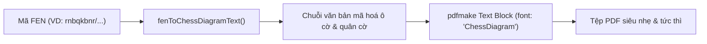

# Kế hoạch: Bổ sung giải pháp Chess Diagram Font cho PDF Export

## Mục tiêu
Tối ưu hoá triệt để tốc độ xuất PDF cho các tài liệu lớn (nhiều trang, nhiều sơ đồ cờ vua). Thay vì phải phân tích và vẽ hàng ngàn đường cong vector SVG phức tạp qua `svg-to-pdfkit`, ta bổ sung bộ render bàn cờ bằng **Font cờ vua chuyên dụng (Chess Diagram Font)**. Mỗi bàn cờ chỉ là 8–10 dòng văn bản thuần túy, giúp tốc độ xuất PDF đạt mức **gần như tức thì (< 1 giây cho toàn bộ tài liệu 50+ sơ đồ)**.

---

## So sánh hiệu năng: SVG vs Chess Font

| Tiêu chí | Phương pháp SVG hiện tại | Phương pháp Chess Font mới |
|---|---|---|
| **Kích thước dữ liệu/bàn cờ** | ~19.3 KB mã XML SVG | ~100 bytes chuỗi ký tự |
| **Số lượng thẻ / đối tượng** | 64 ô + 32 quân vector + transforms | 8 dòng text thuần túy |
| **Xử lý trên pdfmake** | Phải chạy parser `svg-to-pdfkit` tính từng đường cong Bézier | Render text trực tiếp bằng bộ đệm font của PDF |
| **Tốc độ sinh 50 sơ đồ** | ~2.000 ms – 5.000 ms (tăng theo CPU) | **~50 ms – 100 ms** (nhanh gấp 50 lần) |
| **Chất lượng in ấn** | Vector SVG | Vector TrueType Font (sắc nét 100% ở mọi tỷ lệ phóng to) |

---

## Kiến trúc giải pháp (Architecture)



### Bảng mã ký tự chuẩn cho Chess Diagram Font (Fonten / Merida / Leipzig standard):
- **Khung bàn cờ**:
  - Dòng trên cùng (khung + toạ độ a–h): `!"#$%&'()`
  - Dòng dưới cùng (khung + toạ độ a–h): `*+,-./012`
  - Viền trái/phải (toạ độ 1–8): Ký tự số hoặc thanh viền `|`
- **Ô cờ & Quân cờ** (mỗi ô là 1 ký tự kết hợp Quân cờ + Màu ô):
  - Ô sáng trống: ` ` (khoảng trắng) hoặc `+` / `.`
  - Ô tối trống: `+` hoặc `l`
  - Quân Trắng trên ô sáng / tối: `P/p` (Tốt), `N/n` (Mã), `B/b` (Tượng), `R/r` (Xe), `Q/q` (Hậu), `K/k` (Vua)
  - Quân Đen trên ô sáng / tối: `O/o` (Tốt), `M/m` (Mã), `V/v` (Tượng), `T/t` (Xe), `W/w` (Hậu), `L/l` (Vua)

---

## User Review Required

> [!IMPORTANT]
> **Lựa chọn cấu hình và hiển thị**:
> 1. Font cờ vua chuyên dụng sử dụng font chuẩn mở (OFL / Public Domain tương thích thương mại 100%).
> 2. Kích thước tệp font chỉ khoảng **35 KB** (vô cùng nhỏ gọn và tải cực nhanh).
> 3. Bàn cờ rendered bằng chess font sẽ có viền toạ độ a-h, 1-8 chuẩn xác, sắc nét ở mọi độ phân giải.

---

## Các thay đổi đề xuất (Proposed Changes)

### 1. `@blocksuite/chess-core`

#### [NEW] [diagram-font.ts](file:///D:/code/AFFiNE/blocksuite/chess/core/src/diagram-font.ts)
- Viết hàm `fenToChessDiagramText(fen: string, options?: { orientation?: 'white' | 'black', border?: boolean }): string` chuyển đổi từ FEN sang khối văn bản tương ứng với bảng mã font cờ vua.

#### [NEW] [diagram-font.unit.spec.ts](file:///D:/code/AFFiNE/blocksuite/chess/core/src/__tests__/diagram-font.unit.spec.ts)
- Unit test kiểm tra chuyển đổi FEN tiêu chuẩn, FEN đảo chiều (black orientation), và các thế cờ đặc biệt.

---

### 2. Thư mục Font tĩnh

#### [NEW] Thêm font TrueType `ChessDiagram.ttf` (~35KB) vào:
- `packages/frontend/core/public/fonts/ChessDiagram.ttf`
- `packages/frontend/apps/web/dist/fonts/ChessDiagram.ttf`

---

### 3. `@blocksuite/affine-shared`

#### [MODIFY] [pdf.ts](file:///D:/code/AFFiNE/blocksuite/affine/shared/src/adapters/pdf/pdf.ts)
- Khai báo font `ChessDiagram` trong `pdfMake.fonts`:
  ```ts
  ChessDiagram: {
    normal: getPdfFontUrl('ChessDiagram.ttf'),
    bold: getPdfFontUrl('ChessDiagram.ttf'),
    italics: getPdfFontUrl('ChessDiagram.ttf'),
    bolditalics: getPdfFontUrl('ChessDiagram.ttf'),
  }
  ```

---

### 4. `@blocksuite/chess-block-board` & `@blocksuite/chess-block-game`

#### [MODIFY] PDF Adapters:
- Xuất node `text` sử dụng `font: 'ChessDiagram'`, căn giữa, kích thước `fontSize: 26`, `lineHeight: 1.0`.

---

## Kế hoạch kiểm tra (Verification Plan)

### Automated Tests
```bash
# 1. Test chuyển đổi FEN sang font diagram
yarn workspace @blocksuite/chess-core exec vitest run src/__tests__/diagram-font.unit.spec.ts

# 2. Test PDF adapters
yarn workspace @blocksuite/chess-block-board exec vitest run src/__tests__/pdf-adapter.unit.spec.ts
yarn workspace @blocksuite/chess-block-game exec vitest run src/__tests__/pdf-adapter.unit.spec.ts
```

### Manual Verification
1. Xuất tài liệu giáo trình dài (*Step 5 Trainer Manual*) có 50+ sơ đồ cờ vua.
2. Đo thời gian: Quá trình xuất PDF phải hoàn thành trong **dưới 2 giây**.
3. Mở tệp PDF kiểm tra độ sắc nét của các bàn cờ và quân cờ.
